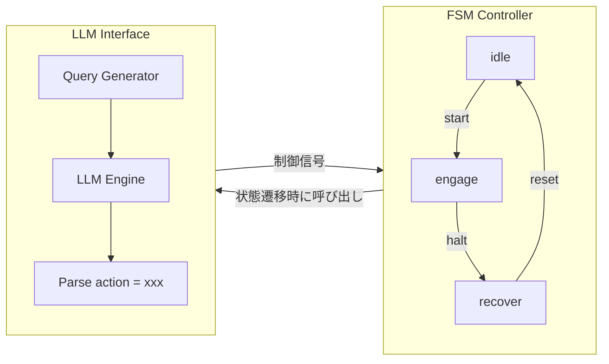

---

# 🧠 FSM×LLM統合制御：構成例  
*Hybrid Control Structure: FSM with LLM Integration*

---

## 📘 状態構成 / State Configuration

- `idle`：監視モード（一定周期で "check" をLLMに送信）  
  *Monitoring mode, periodically sends "check" to LLM*
- `engage`：動作中。LLMが "continue" / "adjust" / "halt" を返す  
  *Active mode; LLM returns "continue", "adjust", or "halt"*
- `recover`：異常対応。LLMに "analyze" を要求  
  *Recovery mode, requests "analyze" from LLM*

---

## 💬 例：LLM出力想定 / Example LLM Output

```text
[LLM応答例 / Example Response]
action = adjust
```

→ FSMは engage 状態中にこの出力を解析し、adjust に対応したサブFSMへ遷移。  
→ FSM parses output during `engage` and transitions to a sub-FSM for `adjust`.

---

## 📊 HDL構成図イメージ / HDL Structure Diagram



---

## 🧩 実装イメージ（擬似コード） / Implementation Example (Pseudocode)

```
if state == engage:
    send_to_llm("system status = hot")
    if llm_response == "action = halt":
        state = recover
```

---

## 🔗 関連教材 / Related Materials

| 項目 / Item | 説明 / Description |
|-------------|--------------------|
| [`fsm/`](../fsm/) | 状態機構の基盤定義 / Base FSM definitions |
| [`fsm_llm_hybrid_example.md`](../fsm_llm_hybrid_example.md) | FSM×LLM制御の構成例 / Example of FSM × LLM control |
| [`execution_logs/`](../execution_logs/) | LLM応答ログを保存可能 / Optional logging of LLM responses |

---

## 🔖 ライセンス / License

MIT License © 2025 [Shinichi Samizo](https://github.com/Samizo-AITL)
