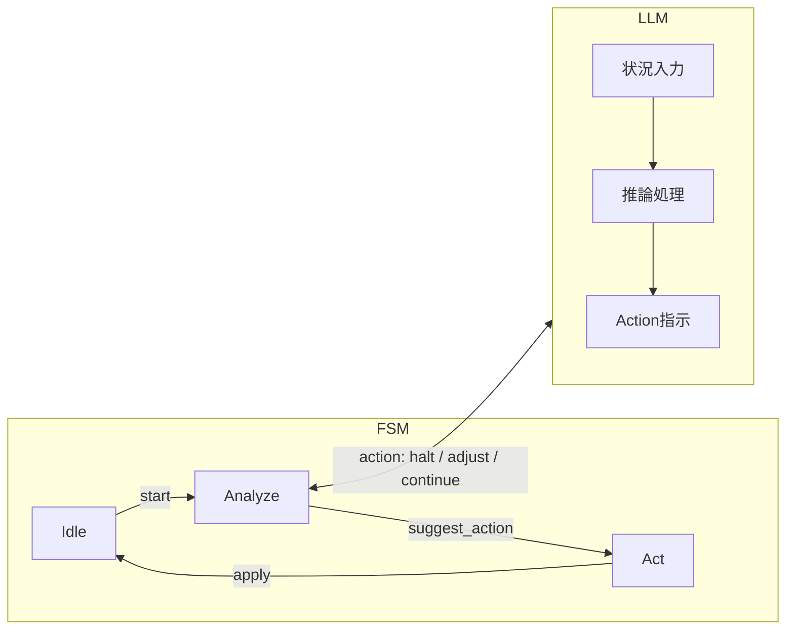

---

# 🤖 llm_control_prompt.md（FSM×LLM統合制御プロンプト）  
*FSM × LLM Hybrid Control Prompt Template*

---

## 🎯 目的 / Objective
**有限状態機械（Finite State Machine: FSM）** による制御構造に、  
**LLM（Large Language Model）** からのトリガ生成・アクション指示を組み合わせるための  
**設計支援プロンプトテンプレート**です。

この構成により、従来のハードウェア制御と外部知能（AI）の連携が可能になります。

---

## 🧠 典型構成 / Typical Architecture

- **FSM**：状態遷移と制御信号の生成を担当  
- **LLM**：状況に応じたイベント判断や最適アクション提案を担当  
- **インタフェース層**：LLMの出力（自然言語や構造化テキスト）をFSMの**トリガ信号**に変換  
  - 例：`trigger = llm_decision`



---

## 💬 プロンプト例 / Example Prompt

```markdown
FSM構造を以下のように定義し、ChatGPTから与えられる文字列出力に応じて状態遷移する設計を提案してください。

States: idle → analyze → act
Triggers: "start", "suggest_action", "apply"

FSMのトリガをLLMの出力と連携するには、どのように設計すべきか、
Verilog HDL記述例とコメント付きで説明してください。
```

---

## 📄 ChatGPT出力例（概要） / Expected ChatGPT Output (Overview)

- `always @(posedge clk)` による同期式FSMの記述  
- LLMからの受信データを解析し、`case`文で状態遷移判定  
- 状態に応じた出力信号や外部制御の生成  
- コメント例：`// LLMの出力 "action=apply" を受けたら act 状態へ遷移`

---

## 🔗 関連教材 / Related Resources

| リソース | 用途 |
|----------|------|
| [`fsm_template.md`](../fsm_template.md) | FSMの基本構造テンプレート |
| [`fsm_to_mermaid.py`](../fsm_to_mermaid.py) | FSM構造の可視化支援ツール |
| [`execution_logs/`](../execution_logs/) | プロンプト実行履歴の保存 |
| [`llm_integration_notes.md`](../llm_integration_notes.md) | LLM連携設計上の注意点 |

---

## 📎 備考 / Notes
- LLMからの出力形式は**一貫性**が重要（例：`action=halt`）  
- 外部通信では**非同期性**や**遅延**を考慮する必要あり  
- 実機実装時にはUART/AXI等の通信プロトコルを介してLLM接続可能

---

## 📄 ライセンス / License
MIT License © 2025 [Shinichi Samizo](https://github.com/Samizo-AITL)  
本プロンプトテンプレートは**教育・設計支援目的で自由に利用・改変可能**です。
