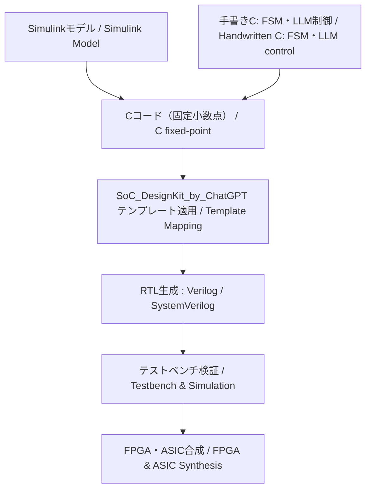

# 🎛️ **EduController：制御理論とAI制御の教育フレームワーク**  
**EduController: Educational Framework for Control Theory and AI Control**

  

---

## 🔗 **公式リンク | Official Links**

| **言語 / Language** | **GitHub Pages 🌐** | **GitHub 💻** |
|---------------------|--------------------|---------------|
| 🇯🇵 **Japanese** |  |  |
| 🇺🇸 **English** |  |  |

---

## 📘 **概要 | Overview**

**JP:**  
**EduController** は、**古典制御**から**現代制御**、さらに **AI ベースの次世代型制御**までを体系的に学べる、**段階的かつ実践的な教材プロジェクト**です。Python による制御理論の直感的理解から **HDL 記述**、**LLM 統合設計**まで幅広くサポートします。  

**EN:**  
**EduController** is a **step-by-step**, **practical educational project** covering **classical**, **modern**, and **AI-based next-generation control**. It supports learning from **control theory in Python** to **HDL coding** and **LLM-integrated design**.

---

<!-- 🚀 Part09誘導バナー -->

  <h2>🌐 次世代制御へ — FSM × PID × LLM</h2>
  
<b>AITLフレームワークによる三層ハイブリッド制御</b> 
     <i>Hybrid Control with FSM, PID, and LLM (AITL Framework)</i>

  <a href="https://samizo-aitl.github.io/EduController/part09_llm_hybrid/" 
     style="display:inline-block; margin-top:10px; padding:10px 20px; background:#4B0082; color:white; border-radius:8px; text-decoration:none; font-weight:bold;">
     🚀 Learn More
  </a>

---

## 🧭 **構成概要 | Structure Overview**

| **系統 / Track** | **内容（JP）** | **Overview (EN)** |
|------------------|---------------|-------------------|
| 🎛️ **制御理論系 (Part 01〜05)** | 古典制御、状態空間、デジタル制御、実装演習 | Classical control, state-space, digital control, practical implementation |
| 🤖 **AI制御系 (Part 06〜08)** | ニューラルネット、強化学習、データ駆動制御 | Neural networks, reinforcement learning, data-driven control |
| 🧠 **統合・応用制御系 (Part 09〜10)** | LLM統合制御、倒立振子総合制御 | LLM-integrated control, inverted pendulum control |

---

## 📚 **章構成一覧 | Chapter Structure**

### 🎛️ **制御理論系 / Classical & Modern Control**

| **Chapter** | **Title** | **Summary** |
|-------------|-----------|-------------|
| **Part 01** | **古典制御理論 / Classical Control Theory**   | **PID制御**を中心に、**時間領域・周波数領域**の解析・設計を体系的に学習。 *Systematic study of PID control, time-domain and frequency-domain analysis & design.* |
| **Part 02** | **現代制御理論 / Modern Control Theory**   | **状態空間表現**を基盤とし、**可制御性・可観測性**、**極配置**、**オブザーバ設計**を学ぶ。 *Covers state-space representation, controllability, observability, pole placement, observer design.* |
| **Part 03** | **適応制御・ロバスト制御 / Adaptive & Robust Control**   | **MRAC**、**H∞制御**、**L1制御**など、パラメータ変動や外乱に強い制御を学ぶ。 *MRAC, H∞, L1 control for robustness against parameter variations and disturbances.* |
| **Part 04** | **デジタル制御と信号処理 / Digital Control & Signal Processing**   | **Z変換**、**離散PID**、**デジタルフィルタ設計**など、デジタル実装向け制御技術を習得。 *Z-transform, discrete PID, digital filter design for implementation.* |
| **Part 05** | **実装・応用編 / Implementation & Applications**   | **Python実装**、**ROS演習**、**FPGA制御**の実システム適用を学ぶ。 *Python, ROS practice, FPGA-based control.*  |

---

### 🤖 **AI制御系 / AI-based Control**

| **Chapter** | **Title** | **Summary** |
|-------------|-----------|-------------|
| **Part 06** | **ニューラルネットによる制御 / Neural Network Control**   | **NN-PID設計**、**逆モデル制御**、ニューラルネットによる高度制御を学ぶ。 *NN-PID design, inverse model control using neural networks.* |
| **Part 07** | **強化学習による制御 / Reinforcement Learning Control**   | **倒立振子や車両制御にRLを適用**、**DDPG**や**PPO**を実装。 *Applying RL to inverted pendulum & vehicle control; implementing DDPG, PPO.* |
| **Part 08** | **データ駆動型制御 / Data-Driven Control**   | **Koopman演算子**、**システム同定**を用いたモデルフリー制御を実装。 *Model-free control using Koopman operator, system identification.* |

---

### 🧠 **統合・応用制御系 / Integrated Control**

| **Chapter** | **Title** | **Summary** |
|-------------|-----------|-------------|
| **Part 09** | **ハイブリッド制御とLLM統合 / Hybrid Control with LLM Integration**   | **FSM×PID×LLM**による三層アーキテクチャで次世代制御設計を実装。 *Three-layer architecture (FSM×PID×LLM) for next-gen control.*  |
| **Part 10** | **倒立振子の総合制御 / Integrated Control of Inverted Pendulum**   | **PID**、**LQR**、**RL**、**HDL実装**を統合した倒立振子制御。 *PID, LQR, RL, HDL implementation integrated for inverted pendulum control.*  |

---

### 🔩 **実装支援ツール / Implementation Toolkit**

| **ディレクトリ** | **概要 / Summary** |
|------------------|--------------------|
| **matlab_tools/**    | **Simulinkによる可視化**、**Cコード生成**、**HDL設計**への展開。 *Visualization in Simulink, C code generation, HDL design.*  |
| **SoC_DesignKit_by_ChatGPT/**   | **FSM・PID・LLM制御テンプレート**、**Verilog生成**、**テストベンチ検証**。 *FSM, PID, LLM control templates, Verilog generation, testbench verification.*  |

#### 🧭 利用フロー概要 / Usage Flow Overview

このツール群は **モデル設計からRTL検証まで** を一気通貫でサポートします。  
**Cの出所は2系統**（Simulink生成C / 手書きC）を想定し、**PID/FSM/LLM制御ロジック**を**統合してHDL化**できます。  
*These tools provide an end-to-end flow from **model design to RTL verification**.  
Two types of C sources are supported (C generated from Simulink / handwritten C), enabling **integration of PID/FSM/LLM control logic into HDL**.*

1. **Simulink または 手書きC (matlab_tools/ など)**  
   - Simulinkでモデルを作成して**固定小数点C**を生成、または  
     FSM／LLM制御用の**手書きC関数**（ステップ関数形式）を用意。  
   *Create a model in Simulink and generate **fixed-point C code**, or  
   prepare **handwritten C step functions** for FSM/LLM control.*

2. **Cコード → HDL (SoC_DesignKit_by_ChatGPT/)**  
   - C関数（PID / FSM / LLM制御カーネル など）をテンプレートにマッピングし、  
     **Verilog/SystemVerilog** と **テストベンチ**を自動生成。  
   - 複数のC機能を**同一SoC内に統合**可能（例：PID + FSM + LLM制御I/F）。  
   *Map C functions (PID / FSM / LLM kernels, etc.) to templates,  
   and automatically generate **Verilog/SystemVerilog** plus **testbenches**.  
   Multiple C modules can be **integrated within the same SoC** (e.g., PID + FSM + LLM I/F).*

3. **シミュレーション & 検証**  
   - 自動生成テストベンチで **C実装とRTLの一致**を確認。  
   - 必要に応じて合成し、**FPGA/ASICフロー**へ展開可能。  
   *Verify functional equivalence between **C implementation and RTL** using the auto-generated testbench.  
   Then proceed to synthesis and deployment in **FPGA/ASIC flows** as needed.*

---

## 🔗 **関連プロジェクト | Related Projects**

- 🎓 **Edusemi-v4x**  
     
  **半導体設計・プロセス教育教材**（Python、sky130、OpenLane）  
  *Semiconductor design & process education (Python, sky130, OpenLane)*  
  

- 🤖 **AITL-H**  
     
  **FSM×PID×LLMの三層制御フレームワーク**（Part09と連携）  
  *Three-layer control framework (FSM×PID×LLM)*  
  

- 🧠 **SamizoGPT**  
     
  **ChatGPTのプロンプト設計支援テンプレート集**（設計支援と連携）  
  *Prompt design templates for ChatGPT (design assistance)*  
  
  
---

## 👤 **執筆者情報 / Author**

| **📌 項目 / Item** | **内容 / Details** |
|--------------------|--------------------|
| **氏名 / Name** | **三溝 真一（Shinichi Samizo）** *Shinichi Samizo* |
| **学歴 / Education** | **信州大学大学院 電気電子工学 修了** *M.S. in Electrical and Electronic Engineering, Shinshu University* |
| **経歴 / Career** | **元 セイコーエプソン株式会社 技術者（1997年〜）** *Former Engineer at Seiko Epson Corporation (since 1997)* |
| **経験領域 / Expertise** | **半導体デバイス**（ロジック・メモリ・高耐圧混載） *Semiconductor devices (logic, memory, high-voltage mixed integration)* **インクジェット薄膜ピエゾアクチュエータ** *Inkjet thin-film piezo actuators* **PrecisionCoreプリントヘッド製品化・BOM管理・ISO教育** *Productization of PrecisionCore printheads, BOM management, and ISO training* |
| **✉️ Email** |  |
| **🐦　X** |  |
| **💻 GitHub** |  |

---

## 📄 **ライセンス | License**

  

> **基本ライセンスは MIT** とし、以下の一部ディレクトリ・教材は **ハイブリッドライセンス** を採用します。  
> *The default license is MIT, but specific directories/materials use a Hybrid License.*

| **📌 項目 / Item** | **ライセンス / License** | **説明 / Description** |
|--------------------|--------------------------|------------------------|
| **基本 / Default** | **[MIT License](https://opensource.org/licenses/MIT)** | 自由に使用・改変・再配布可能 |
| **ハイブリッド対象 / Hybrid Scope** |   Part05, Part09, Part10, matlab_tools, SoC_DesignKit_by_ChatGPT | 教材・コード・図表の性質に応じて **[MIT License](https://opensource.org/licenses/MIT)** / **[CC BY 4.0](https://creativecommons.org/licenses/by/4.0/)** / **[CC BY-SA 4.0](https://creativecommons.org/licenses/by-sa/4.0/)** / **[CC BY-NC 4.0](https://creativecommons.org/licenses/by-nc/4.0/)** を適用 |

---

## 💬 **フィードバック | Feedback**

> 改善提案や議論は **GitHub Discussions** からお願いします。  
> *Propose improvements or start discussions via GitHub Discussions.*

