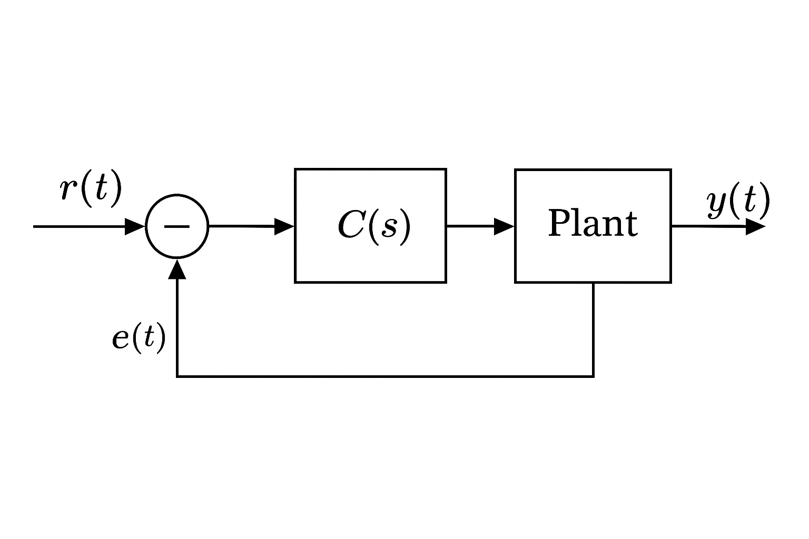

---

# 🧩 01. PID制御の基礎  
**01. Introduction to PID Control**

> **ℹ️ 数式が正しく表示されない場合があります**  
> Website (GitHub Pages) では数式が崩れる場合があります。  
> 正しい表示はGitHubのソースをご確認ください。  
> If math formulas do not display correctly on the Website, please check the source on GitHub:  
> [📄 View on GitHub](https://github.com/Samizo-AITL/EduController/blob/main/part01_classical/theory/01_pid_control.md)

---

PID（比例・積分・微分）制御は、最も基本的かつ広く使われているフィードバック制御の一種です。本節では、PID制御の原理と、それぞれの要素が制御系に与える影響を理解し、動作と設計の基本を習得します。  
PID (Proportional–Integral–Derivative) control is one of the most fundamental and widely used feedback control methods. This section explains the principles and effects of each term, and introduces basic design techniques.

---

## 🎯 本節の学習目標｜Learning Objectives

- **PID各成分（P, I, D）の役割を理解する**  
  Understand the role of each PID term (P, I, D)  
- **各成分が応答に与える影響（速度・安定性・誤差）を説明できる**  
  Explain how each term affects speed, stability, and error  
- **ブロック線図と伝達関数で制御系を表現できる**  
  Represent control systems using block diagrams and transfer functions  
- **Python/MATLABでステップ応答を可視化できる**  
  Visualize step responses with Python/MATLAB

---

## ⚙️ PID制御とは？｜What is PID Control?

PID制御は、以下の式で制御量 $u(t)$ を定義します：  
PID control defines the control input $u(t)$ as:

$$
u(t) = K_P e(t) + K_I \int_0^t e(\tau)\,d\tau + K_D \frac{de(t)}{dt}
$$

- $e(t)$：目標値と現在値の偏差（誤差）  
  Error between reference and measured value  
- $K_P$：比例ゲイン (Proportional gain)  
- $K_I$：積分ゲイン (Integral gain)  
- $K_D$：微分ゲイン (Derivative gain)  

---

## 🧠 各成分の役割と影響｜Roles and Effects of P, I, D

| 成分 | 名称 / Name | 働き / Function | 効果 / Effect |
|------|------------|----------------|---------------|
| **P** | 比例 (Proportional) | 誤差に比例した出力 | 応答速度を向上、過大で振動の原因 |
| **I** | 積分 (Integral) | 過去の誤差を累積 | 定常偏差を除去、過剰で応答遅延 |
| **D** | 微分 (Derivative) | 誤差の変化率に応答 | 応答を滑らかに、ノイズに敏感 |

---

## 🔧 ブロック線図と伝達関数｜Block Diagram & Transfer Function

**▶ ブロック線図（例）｜Example Block Diagram**  

  

**▶ 伝達関数（ラプラス領域）｜Transfer Function (Laplace Domain)**  

$$
C(s) = K_P + \frac{K_I}{s} + K_D s
$$

---

## 🌀 ステップ応答の比較｜Step Response Comparison

同一の一次遅れ系に対して、各制御要素を個別に加えたときの例：  

| 制御 / Control | 応答特性 / Characteristics | 備考 / Remarks |
|----------------|----------------------------|----------------|
| **P** のみ | 応答は速いが定常誤差あり | 単純比例制御 / Simple proportional control |
| **PI** | 定常誤差を解消するが応答は遅い | 低速系向き / Suitable for slow systems |
| **PD** | オーバーシュート抑制、誤差残る | ノイズに弱い / Sensitive to noise |
| **PID** | 安定性と応答性を両立 | 最も一般的 / Most widely used |

実装例は [`/simulation/pid_simulation.py`](../simulation/pid_simulation.py) を参照。  
See [`/simulation/pid_simulation.py`](../simulation/pid_simulation.py) for implementation.

---

## 💡 設計のポイント｜Design Tips

- **ゲイン調整（チューニング）が最重要**  
  Gain tuning is critical (Ziegler–Nichols, Cohen–Coon, empirical rules)  
- **D項はノイズに注意**  
  Derivative term amplifies noise  
- **実装時は離散化が必要**  
  Discretization required for implementation (Tustin, forward difference, etc.)

---

## 📚 参考資料｜References

- 「制御工学入門」森北出版  
- *Feedback Control of Dynamic Systems* – Franklin, Powell, Emami-Naeini  
- Libraries: `control`, `matplotlib`, `numpy`

---

**➡️➡️ [次節 / Next Section](https://samizo-aitl.github.io/EduController/part01_classical/theory/02_transient_response.html)**  
ステップ応答・時間定数・定常偏差の評価方法を学びます。  
Learn step response, time constant, and steady-state error evaluation.

**📚 [この章のREADMEへ / Back to Part 1 README](https://samizo-aitl.github.io/EduController/part01_classical/)**  
古典制御理論の全体構成と教材一覧に戻ります。  
Return to the full Part 1 structure and materials list.
