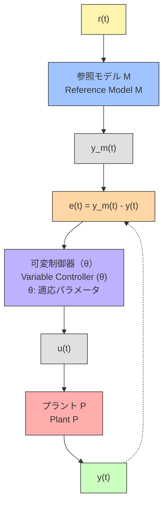

---

# 🎯 02. モデル参照型適応制御（MRAC：Model Reference Adaptive Control）

> ⚠️ **Mermaid図について**  
> Website版ではMermaid図が表示されない場合があります。  
> 正しく表示したい場合は **[GitHub版はこちら](https://github.com/Samizo-AITL/EduController/blob/main/part03_adaptive/theory/02_mrac_design.md)** をご覧ください。

---

**MRAC**は、制御対象（Plant）に対して**理想的な動作をする「参照モデル」**を設定し、  
そのモデルに近づくように制御器のパラメータを**リアルタイムに調整**する、代表的な適応制御手法です。  
**MRAC** sets an **ideal “reference model”** for the plant and **updates controller parameters online** so the plant follows the model.

---

## 🎯 学習目標 / Learning Goals

| # | 日本語 / Japanese | English |
|---|-------------------|---------|
| 1 | MRACの基本構造と考え方を理解 | Understand MRAC structure & idea |
| 2 | MITルールによる適応律の導出を説明 | Explain update law via MIT rule |
| 3 | 誤差を用いたゲイン更新の意味を理解 | Understand error-driven gain updates |
| 4 | Pythonで簡単なMRAC実装 | Implement a simple MRAC in Python |

---

## ⚙️ MRACの基本構成 / Basic Structure

- **適応律（Updater）** がパラメータ $\theta$ を更新  
- **可変制御器** は更新後パラメータで制御

---

## 📘 例：1次系への適用 / Example to 1st-Order Plant

| 項目 / Item | 数式 / Equation | 説明 / Description |
|---|---|---|
| 対象プラント / Plant | $P(s)=\dfrac{k}{\tau s+1}$ | $k,\tau$ 未知（安定・正系） |
| 参照モデル / Ref. model | $M(s)=\dfrac{1}{T_m s+1}$ | 目標応答を規定 |

---

## 🧠 可変制御器（例） / Controller (example)

$$
u(t)=\theta_1\,r(t)+\theta_2\,y(t)
$$

- $\theta_1,\theta_2$ は**オンライン更新** / updated online.

---

## 🔁 MITルール / MIT Rule

| 項目 / Item | 数式 / Equation |
|---|---|
| 誤差 / Error | $e(t)=y(t)-y_m(t)$ |
| コスト / Cost | $J(\theta)=\tfrac12 e(t)^2$ |
| 更新 / Update | $\dot{\theta}_i=-\gamma_i\,e(t)\,\dfrac{\partial e(t)}{\partial \theta_i}$ |

- $\gamma_i$: 適応ゲイン（学習率） / adaptation gain (learning rate)  
- 感度 $\partial e/\partial\theta_i$ を用いて更新

---

## 📐 実装の注意 / Implementation Notes

- $\gamma$ が**大**→ 発散リスク、**小**→ 収束遅い / Large → divergence, small → slow  
- ノイズに敏感 → **フィルタ/ロバスト化**が有効 / filtering & robustification help  
- Lyapunov安定化型の更新則も一般的 / Lyapunov-based laws are common

---

## 📚 参考資料 / References

- Ioannou & Sun, *Robust Adaptive Control*  
- Åström & Wittenmark, *Adaptive Control*  
- Slotine & Li, *Applied Nonlinear Control*

---

**⬅️ 前節 / Previous:** [01. 適応制御の概要](https://samizo-aitl.github.io/EduController/part03_adaptive/theory/01_adaptive_intro.html)  
適応制御の基本概念と必要性を解説 / Introduction and necessity of adaptive control

**➡️➡️ 次節 / Next:** [03. ゲインスケジューリング](https://samizo-aitl.github.io/EduController/part03_adaptive/theory/03_gain_scheduling.html)  
状態に応じたゲイン切替の手法 / Method of switching gains based on system state

**📚 第3章 README / Chapter Top:** [適応制御とロバスト制御](https://samizo-aitl.github.io/EduController/part03_adaptive/)  
第3章の全体構成と教材一覧 / Overview and chapter contents
