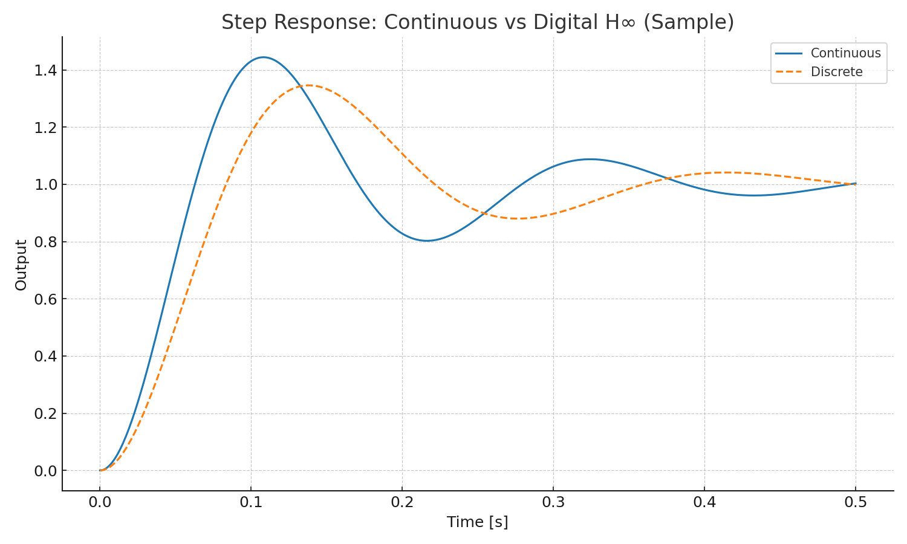
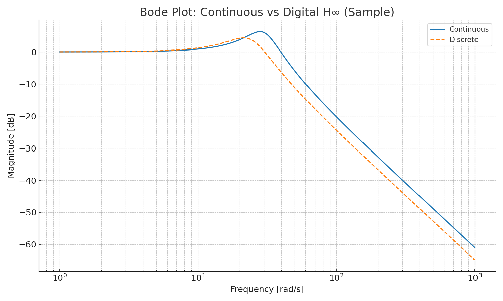

# 🎯 06. デジタル H∞ 制御 / Digital H∞ Control

> ℹ️ **数式が正しく表示されない場合はGitHub版をご確認ください**  
> If equations do not render properly, see the [GitHub version](https://github.com/Samizo-AITL/EduController/blob/main/part04_digital/theory/06_digital_hinf_control.md)

---

## 📖 概要 / Overview

**デジタル H∞ 制御**は、ロバスト制御の一種であり、外乱やモデル誤差に対して安定性と性能を保証する制御器を、離散時間系で設計する手法です。  
Digital H∞ control is a robust control approach implemented in discrete time, designed to ensure stability and performance against disturbances and model uncertainties.

本教材では、**連続時間 H∞ 設計 → 離散化 → デジタル実装 → 周波数応答評価** の流れを示します。  
We cover the flow from **continuous-time H∞ design → discretization → digital implementation → frequency response evaluation**.

---

## 🎯 学習目標 / Learning Goals

- H∞ 制御の基本構造を理解する  
  Understand the basic structure of H∞ control  
- 連続時間 H∞ 制御器を MATLAB で設計できる  
  Design continuous-time H∞ controllers in MATLAB  
- 離散化方法（双一次変換など）を理解する  
  Understand discretization methods such as bilinear transform  
- Simulink モデルで動作を検証できる  
  Validate the controller behavior using Simulink  

---

## 📐 制御問題の定義 / Problem Formulation

### 感度関数と補償関数 / Sensitivity and Complementary Sensitivity
```math
S(s) = \frac{1}{1 + G(s)K(s)}, \quad T(s) = 1 - S(s)
```
$S(s)$：外乱抑制性能（低周波域で小さく）  
$T(s)$：ノイズ抑制性能（高周波域で小さく）  

### H∞ 最適化条件 / H∞ Optimization Objective
```math
\| T_{zw}(s) \|_\infty < \gamma
```
- $T_{zw}(s)$：外乱 $w$ から性能出力 $z$ への伝達関数  
- $\| \cdot \|_\infty$：全周波数帯域での最大ゲイン（無限ノルム）  

---

## 🛠️ MATLABによる設計例 / MATLAB Design Example

```matlab
% 状態空間モデル例
A = [...]; B = [...]; C = [...]; D = zeros(size(C,1), size(B,2));
P = ss(A,B,C,D);

% 重み付け関数（性能W1, 制御W2）
s = tf('s');
W1 = (s/10 + 1)/(s/100 + 1);   % 感度関数重み
W2 = (s/100 + 1)/(s/1000 + 1); % 補償関数重み
Paug = augw(P, W1, W2);

% H∞制御器設計
nmeas = 1; ncon = 1;
[K,CL,gamma] = hinfsyn(Paug, nmeas, ncon);

% 性能確認
sigma(CL); grid on
disp("H∞ gamma = " + gamma);
```

---

## 🔄 離散化 / Discretization

### サンプリング周期の選定
- 応答帯域の **1/10 程度**を目安に設定
- 例：帯域が 100 Hz → $T_s \approx 1 \ \mathrm{ms}$

### 双一次変換（Tustin法）による離散化
```matlab
Ts = 0.001;                 % 1 ms サンプリング
Kd = c2d(K, Ts, 'tustin');  % デジタル制御器
```

---

## 🧪 Simulinkによる検証 / Validation with Simulink

- Simulinkモデル `digital_hinf_simulink.slx` で閉ループを構成  
- 外乱入力、測定ノイズを加えて $S(z)$、$T(z)$ の挙動を確認  
- ステップ応答と周波数応答を比較

<figure>
  
  <figcaption>
    **図1 / Fig.1 — ステップ応答（連続 vs 離散H∞）**  
    連続設計と離散実装の応答を比較。離散側はわずかに帯域が低く、減衰が大きい。  
    *Step responses of continuous design and digital implementation. The digital one shows slightly lower bandwidth and higher damping.*
  </figcaption>
</figure>

<figure>
  
  <figcaption>
    **図2 / Fig.2 — ボード線図（連続 vs 離散H∞）**  
    中高周波でのゲイン差を可視化し、離散化の影響を確認。  
    *Bode magnitude comparison highlighting mid–high frequency differences due to discretization.*
  </figcaption>

---

## 📊 ロバスト性評価 / Robustness Metrics

| 指標 / Metric        | 説明 / Description | 目安 / Guideline | 評価 / Rating |
|----------------------|--------------------|------------------|---------------|
| ゲイン余裕 GM        | 増幅許容量 / Gain tolerance | > 6 dB | ○ |
| 位相余裕 PM          | 遅延許容量 / Phase tolerance | > 30° | ○ |
| $\|S\|_\infty$       | 感度関数の無限ノルム / Infinity norm of sensitivity | < 2.0 | ◎ |

> **Note:** $\|S\|_\infty$ が小さいほど外乱に強い。2.0 は約 6 dB に相当。

---

## 💡 実装のヒント / Implementation Notes

- 固定小数点化時の量子化誤差対策  
- 演算遅延の位相余裕への影響評価  
- Simulink Coder による C コード生成 → FPGA実装（`SoC_DesignKit_by_ChatGPT/c_to_hdl/`）

---

## 📚 参考文献 / References

- Zhou & Doyle, *Essentials of Robust Control*  
- Skogestad & Postlethwaite, *Multivariable Feedback Control*  
- MATLAB Robust Control Toolbox Documentation  

---

**⬅️ 前節 / Previous:** [05. FFTによる信号分析と雑音除去](https://samizo-aitl.github.io/EduController/part04_digital/theory/05_fft_analysis.html)  
**🏠 第4章トップ:** [デジタル制御と信号処理](https://samizo-aitl.github.io/EduController/part04_digital/)  
**➡️ 次章 / Next Chapter:** [Part 05: 実装・応用演習](https://samizo-aitl.github.io/EduController/part05_practical/)
