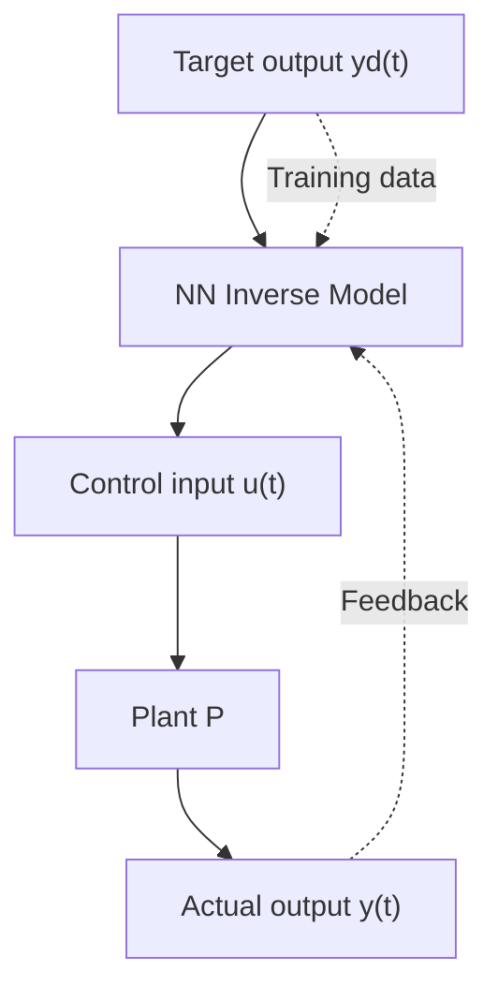

---

# 🔁 03. 逆モデル制御とニューラルネット  
**Inverse Model Control with Neural Networks**

> 💡 **Note:** 数式やMermaid図がWebで正しく表示されない場合は、[GitHub版ページはこちら](https://github.com/Samizo-AITL/EduController/blob/main/part06_nn_control/theory/03_inverse_model.md) を参照してください。

---

本節では、**制御対象（プラント）の逆モデル**をニューラルネット（NN）で学習し、  
**目標出力から必要な制御入力を直接推定する手法**を解説します。  
この手法は、非線形系や未知パラメータを持つシステムにおいて有効です。

---

## 🎯 **学習目標 / Learning Objectives**

- **逆モデル制御**の基本概念と構成を理解する  
- NNによる逆モデルの**学習方法と適用手順**を学ぶ  
- 実験適用時の**利点・課題**を整理する  

---

## 🔄 **1. 逆モデル制御とは**

制御対象 $P$ の動作が $u(t) \rightarrow y(t)$ で表されるとき、  
**その逆関数** $P^{-1}$ をNNで近似します。  
目標出力 $y_d(t)$ を入力として、必要な制御入力 $u(t)$ を出力します。

$$
\begin{align*}
y(t) &= P(u(t)) \\
u(t) &= f_\theta(y_d(t), y(t), \dots) \approx P^{-1}(y_d)
\end{align*}
$$

> 📌 **ポイント:** 逆モデルが精度良く学習されれば、**直接的なフィードフォワード制御**が可能になります。

---

## 🧠 **2. 構成図と信号の流れ（Mermaid版）**

> 🌐 **Mermaid図が表示されない場合は**  
> [GitHubで直接確認してください](https://github.com/Samizo-AITL/EduController/blob/main/part06_nn_control/theory/03_inverse_model.md)

- NNは**目標値と現在の状態**から必要な操作量を推定  
- 教師信号は $u(t)$（実際に使われた制御入力）

---

## 🛠️ **3. 学習と適用**

| **項目 / Item**     | **内容 / Details**                                |
|---------------------|---------------------------------------------------|
| **入力特徴量**      | $y_d(t)$, $y(t)$, 過去の $u(t-k)$ など              |
| **出力（教師信号）**| $u(t)$：目標出力を得るための入力                   |
| **ネット構成**      | MLPやLSTM（時系列考慮）、正則化が重要               |
| **学習方法**        | MSE損失 $\|u_{\text{true}} - \hat{u}\|^2$           |

---

## ✅ **4. 利点と課題**

### ✅ メリット
- モデルが得られれば、**即時的かつ高速な制御**が可能  
- 複雑なPIDチューニングが不要  
- 非線形性や時変性に柔軟に適応できる  

### ⚠️ 課題
- **逆関数が存在しない**（非一意）な場合、精度が不安定  
- **大量かつ高品質なデータ**が必要  
- 安定性保証が難しく、未知状態に弱い  

---

## 🧪 **5. 実装例と実験（次章）**

- [`inverse_model_train.py`](../simulation/inverse_model_train.py)  
  逆モデルNNの訓練スクリプト  
- [`ai_vs_pid_sim.py`](../simulation/ai_vs_pid_sim.py)  
  逆モデル制御 vs PID の比較実験  
- 実験対象例：一次遅れ系 / 倒立振子 / モータ制御モデル  

---

## 📚 **参考文献 / References**

- Narendra & Parthasarathy (1990) — *Neural Networks for System Identification and Control*  
- Deep Inverse Models (DIM) in Adaptive Control  
- 本教材 [`part06_nn_control/`](https://samizo-aitl.github.io/EduController/part06_nn_control/) 内のコード群  

---

**⬅️ [前節 / Previous](https://samizo-aitl.github.io/EduController/part06_nn_control/theory/02_nn_pid.html)**  
NN-PID制御の構造と学習方法、利点・課題を解説。  
Covers NN-aided PID structure, training, advantages, and limitations.

**➡️➡️ [次節 / Next](https://samizo-aitl.github.io/EduController/part06_nn_control/theory/04_ai_vs_classical.html)**  
AI制御と古典制御の比較と統合戦略を解説。  
Covers comparison and hybrid strategies of AI-based and classical control.

**🏠 [Part 06 トップ / Back to Part 06 Top](https://samizo-aitl.github.io/EduController/part06_nn_control/)**  
全体概要と各章リンクを掲載。  
Provides full overview and links to all sections.
