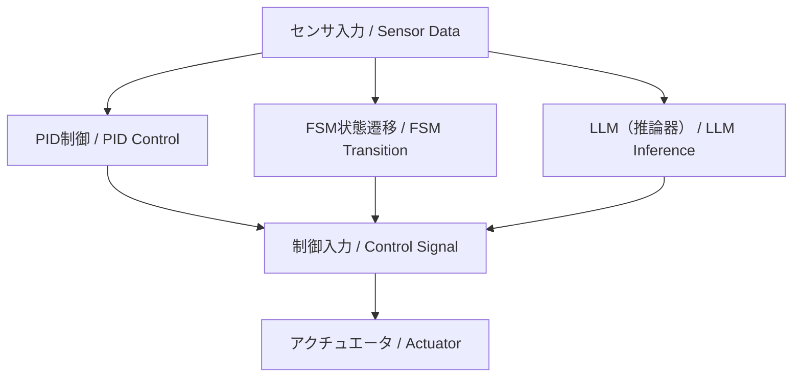

---

# 🤖 Part 9: ハイブリッド制御とLLM統合 / Hybrid Control with LLM Integration

---

> ⚠️ **Note / 注記**  
> 本章は **教育・研究用の構想段階** の内容です。  
> - **安定性と応答設計はPID等の制御理論に基づく**ことを前提としています。  
> - **FSMやLLMは外層の監督・支援層**であり、直接的な安定性保証の対象には含まれません。  
> - 記述内容はPoCや教育実験の一部であり、今後の検証で変更される可能性があります。  
> *This chapter is at a **conceptual / research stage**.  
> - **Stability and response design rely on classical control theory (e.g., PID)**.  
> - **FSM and LLM act as outer supervisory / support layers**, not part of the stability-guaranteed control loop.  
> - Contents are PoC / educational experiments and may change with further validation.*

本章では、**状態機械（FSM）・物理制御（PID）・大規模言語モデル（LLM）** を組み合わせた  
柔軟かつ適応的な**三層統合型制御アーキテクチャ**を設計・実装します。  
*This chapter explores the design and implementation of a three-layer hybrid control architecture,  
combining FSM (Finite State Machine), PID control, and LLMs (Large Language Models).  
It is based on the AITL framework (FSM × PID × LLM), aiming to build adaptable and intelligent control systems for the AI era.*

---

## 🎯 **学習目標 / Learning Objectives**

- **FSMとPID制御**の連携手法を理解する  
- **LLM（ChatGPT等）を制御判断に活用**する手法を学ぶ  
- **ルール・対話ベースの制御戦略**を設計できる  
- **異常対応・目的推論・シナリオ制御**を体験する  
- **AITL三層構造によるPoC実装**を行う  

---

## 🧩 **章構成（理論教材）/ Chapter Structure (Theory)**

| **ファイル / File** | **内容 / Description** |
|---------------------|-------------------------|
| [01_fsm_pid_llm.md](theory/01_fsm_pid_llm.md) | FSM・PID・LLMによる三層制御構造の全体像 |
| [02_scenario_control.md](theory/02_scenario_control.md) | シナリオ制御と状態モード切替の設計 |
| [03_exception_handling.md](theory/03_exception_handling.md) | LLMを用いた異常検出と例外対応 |
| [04_goal_reasoning.md](theory/04_goal_reasoning.md) | 目的推論と対話型制御の導入 |

---

## 🧪 **実装コードとNotebook / Simulation Code & Notebooks**

| **ファイル / File** | **役割 / Function** |
|----------------------|----------------------|
| [fsm_pid_llm_sim.py](simulation/fsm_pid_llm_sim.py) | 三層制御統合シミュレーション（FSM × PID × LLM） |
| [goal_reasoning_agent.py](simulation/goal_reasoning_agent.py) | LLMベースの目的推論エージェントクラス |
| [hybrid_control_demo.ipynb](notebooks/hybrid_control_demo.ipynb) | Notebook可視化デモ（予定） |

> 💡 **特長 / Highlights**  
> - センサ入力、PID制御、FSM遷移、LLM出力を可視化可能  
> - 小さなコード改変からシステム全体設計まで段階的に学べる  
> - LLMによる対話応答例や意図推論ログを確認できる  

---

## 📘 **章と実装対応表 / Mapping Between Theory and Code**

| **教材章 / Section** | **内容 / Topic** | **実装ファイル / Script** | **備考 / Notes** |
|------------------|------------------|-----------------------------|------------------|
| 第1章 | FSM・PID・LLM統合 | `fsm_pid_llm_sim.py` | 状態遷移＋PID＋LLM のPoC |
| 第2章 | シナリオ制御 | `fsm_pid_llm_sim.py` | FSMに基づくモード管理 |
| 第3章 | 例外処理 | LLMログ出力部 | 状況判断・切替ロジック |
| 第4章 | 目的推論制御 | `goal_reasoning_agent.py` | 自律的意思決定のシミュレーション |

---

## 🧠 **LLMの最小理屈と利用形態**

- **Attention**：過去情報を動的に重み付け → PIDの固定ゲインと対比して柔軟性を拡張  
- **潜在表現**：内部ベクトルは状態空間近似と見なせる  
- **確率的出力**：分布として予測 → 行動候補分布に対応  

**分類**  
- クラウド型（ChatGPT 等）：設計支援・自然言語インタフェース向き  
- 組み込み型（LLaMA, Phi, Mistral 等）：制御ループ内に統合可能  

👉 FSMやPIDと組み合わせることで **安定性＋柔軟性** を両立できる。

---

## 🔗 **三層統合制御アーキテクチャ（概念図）**

---

## 🔜 **今後の展開 / Next Steps**

- ChatGPT API と実機制御の検証  
- ロボット／GUI／音声対話によるシナリオ制御  
- 強化学習との統合による自己適応制御（Part 10 予定）

---

## 🔗 関連章リンク / Related Chapters

- [2.6 FSM導入と状態制御の基本 (Edusemi-v4x)](https://samizo-aitl.github.io/Edusemi-v4x/chapter2_comb_logic/2.6_fsm_intro.html)  
- [第8章 FSM設計 (Edusemi-v4x)](https://samizo-aitl.github.io/Edusemi-v4x/d_chapter8_fsm_design_basics/)  
- [01 PID制御の基礎 (EduController)](../part01_classical/theory/01_pid_control.md)  

---

## 📚 **参考資料 / References**

- OpenAI ChatGPT: <https://platform.openai.com/>  
- EduController (GitHub): <https://github.com/Samizo-AITL/EduController>  
- FSM/PID/LLM の統合構想：AITL構想（AITL-H）

---

## 👤 **著者・ライセンス | Author & License**

| 📌 項目 | 📄 内容 |
|------|------|
| **著者** | **三溝 真一**（Shinichi Samizo） |
| **GitHub** | [Samizo-AITL](https://github.com/Samizo-AITL) |

---

## 📄 **ライセンス / License**

| 📌 項目 | ライセンス | 説明 |
|------|-----------|------|
| **コード** | [MIT License](https://opensource.org/licenses/MIT) | 自由に使用・改変・再配布が可能 |
| **教材テキスト** | [CC BY 4.0](https://creativecommons.org/licenses/by/4.0/) | 著者表示必須 |
| **図表・イラスト** | [CC BY-NC 4.0](https://creativecommons.org/licenses/by-nc/4.0/) | 非商用利用のみ許可 |
| **外部引用** | 元ライセンスに従う | 引用元を明記 |

---

**⬅️ [前章 / Previous Chapter](../part08_data_driven/index.md)**  
**[次章 / Next Chapter ➡️➡️](../part10_pendulum/index.md)**  
**🏠 [トップページ / Back to Home](../index.md)**
