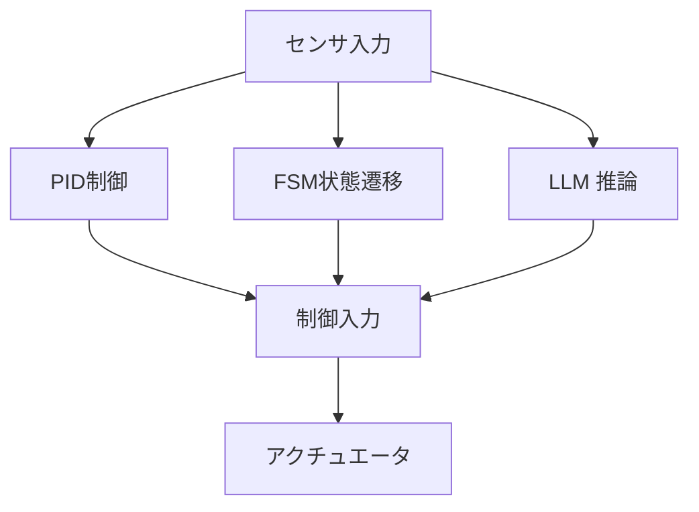

---

# 🤖 01. FSM・PID・LLMによるハイブリッド制御（AITL構想）  
*Hybrid Control with FSM, PID, and LLM (AITL Framework)*

---

本節では、FSM（本能層）、PID（理性層）、LLM（知性層）という  
**三層構造のハイブリッド制御アーキテクチャ**である「AITL構想」について解説します。  

---

## 🧠 **AITL構想とは？ / What is AITL Framework?**

AITL（Artificial Instinct–Thinking–Language）は、以下の3層構造を持つ制御モデルです：

| **層 / Layer** | **要素 / Element** | **役割 / Role** |
|----|------|------|
| **本能層 / Instinct Layer** | FSM（状態機械） | 基本動作やルール実行 |
| **理性層 / Reasoning Layer** | PID制御 | 物理系の安定・精度を保証 |
| **知性層 / Intelligence Layer** | LLM（大規模言語モデル） | 状況判断・例外対応・目的推論・対話 |

---

## 🧩 **各層の制御構成**

### ✅ FSM
- タスクの流れや状態遷移条件を定義  
- 例：ロボットの「停止 → 前進 → 回避」フロー  

### ✅ PID制御
- フィードバック制御の中心  
- FSMの各状態での制御器として動作  
- 実時間で物理系とやり取り  

📐 基本式：
$$
u(t) = K_p e(t) + K_i \int_0^t e(\tau)\, d\tau + K_d \frac{de(t)}{dt}
$$

### ✅ LLM
- **クラウド型（ChatGPT 等）**：設計支援や対話に強い  
- **組み込み型（LLaMA, Phi, Mistral 等）**：制御ループに組込み可能  

📐 Attention の式：
$$
\text{Attention}(Q,K,V) = \text{softmax}\!\left(\tfrac{QK^T}{\sqrt{d_k}}\right)V
$$

PIDのゲイン調整と対比できる。

---

## 🏗️ **構成図**

---

## 🔍 **例：自律移動ロボット**

| **状態** | **FSM動作** | **PID制御** | **LLM関与** |
|------|---------|----------|----------|
| 前進 | MoveForward | 距離維持 | 行先判断 |
| 停止 | Idle | 出力ゼロ | 対話・指示待ち |
| 回避 | Avoid | 軌道調整 | 回避方向の判断 |

---

## 💡 **目的と利点**

- FSM：ルールベースの安定性保持  
- PID：精密な物理制御  
- LLM：環境変化・例外対応・新規タスク適応  

---

## 📁 **次へ / Next**

📄 [02_scenario_control.md](02_scenario_control.md)

---

**⬅️ [Part 9 トップに戻る](../index.md)**  
**🏠 [トップページ](../../../index.md)**
