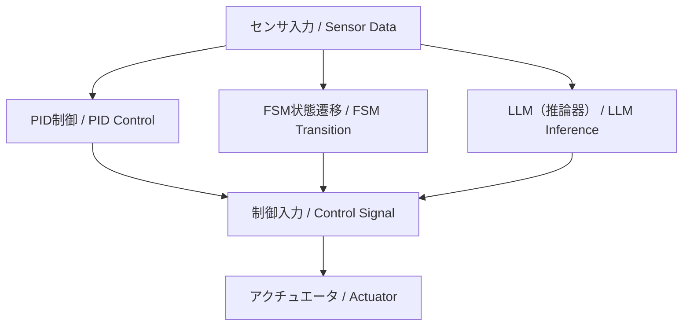

---

# 🤖 01. FSM・PID・LLMによるハイブリッド制御（AITL構想）  
**Hybrid Control with FSM, PID, and LLM (AITL Framework)**

---

本節では、FSM（本能層）、PID（理性層）、LLM（知性層）という  
**三層構造のハイブリッド制御アーキテクチャ**である「AITL構想」について解説します。  

This section explains the **three-layer hybrid control architecture** — FSM (Instinct Layer), PID (Reasoning Layer), and LLM (Intelligence Layer) — known as the **AITL Framework**.

---

## 🧠 **AITL構想とは？ / What is AITL Framework?**

AITL（Artificial Instinct–Thinking–Language）は、以下の3層構造を持つ制御モデルです：  

AITL (Artificial Instinct–Thinking–Language) is a control model with the following three layers:

| **層 / Layer** | **要素 / Element** | **役割 / Role** |
|----|------|------|
| **本能層 / Instinct Layer** | FSM（状態機械 / Finite State Machine） | 基本動作やルール実行（ON/OFF制御、フロー制御） Executes basic operations and rules (ON/OFF, flow control) |
| **理性層 / Reasoning Layer** | PID制御（Proportional–Integral–Derivative） | 物理系の安定・精度を保証する連続制御 Ensures stability and precision of physical systems |
| **知性層 / Intelligence Layer** | LLM（大規模言語モデル / Large Language Model） | 状況判断・例外対応・目的推論・対話 Contextual reasoning, exception handling, goal inference, and dialogue |

---

## 🧩 **各層の制御構成 / Control Structure by Layer**

### ✅ **FSM（状態機械 / Finite State Machine）**

- タスクの流れや状態遷移条件を定義  
- Defines the flow of tasks and state transition conditions  
- 例 / Example：ロボットの「停止 → 前進 → 回避」フロー  
  Robot flow: "Stop → Move Forward → Avoid"

### ✅ **PID制御（Proportional–Integral–Derivative Control）**

- フィードバック制御の中心  
- Core of feedback control  
- FSMの各状態での制御器として動作  
- Operates as the controller in each FSM state  
- 実時間で物理系とやり取り  
- Interacts with the physical system in real time

### ✅ **LLM（Large Language Model）**

LLMは以下の二系統で利用可能です：  

- **クラウド型（ChatGPT等）**  
  - 設計支援、自然言語インタフェース、知識検索  
- **組み込み型（LLaMA系, Phi-3-mini, Mistral等）**  
  - 制御ループに直接組み込み、リアルタイムな推定やゲイン調整に使用  

**LLMの最小理屈（制御視点）**  
- **Attentionの役割**：過去系列を動的に加重（PIDゲインに相当）  
- **潜在表現**：観測から状態を近似（状態推定器として機能）  
- **確率的出力**：候補行動分布を生成（制御入力候補に対応）

---

## 🏗️ **構成図（概要）/ Architecture Overview**

---

## 🔍 **例：自律移動ロボット / Example: Autonomous Mobile Robot**

| **状態 / State** | **FSM動作 / FSM Action** | **PID制御 / PID Control** | **LLM関与 / LLM Involvement** |
|------|---------|----------|----------|
| **前進 / Move Forward** | MoveForward | 距離維持 / Distance Keeping | 行先判断 / Destination Decision |
| **停止 / Stop** | Idle | 出力ゼロ / Zero Output | 指示待ち・対話 / Await Command, Dialogue |
| **障害物回避 / Avoid Obstacle** | Avoid | 軌道調整 / Path Adjustment | 回避方向の判断 / Avoidance Direction Decision |

---

## 💡 **目的と利点 / Purpose and Advantages**

- **FSM** によるルールベースの安定性保持  
  Stability via rule-based FSM control  
- **PID** による精密な物理制御  
  Precision via continuous PID control  
- **LLM** による環境変化・例外対応・新規タスク適応  
  Adaptability to environment changes, exceptions, and new tasks via LLM  
- 状況依存の柔軟な**知能制御システム**構築が可能  
  Enables flexible **intelligent control systems** adaptable to context

---

## 📁 **次へ / Next**

次節では、具体的な「シナリオ制御とLLM活用」について解説します。  
In the next section, we will discuss **scenario-based control and LLM utilization**.

📄 [02_scenario_control.md](https://samizo-aitl.github.io/EduController/part09_llm_hybrid/theory/02_scenario_control.html)

---

**⬅️ [Part 9 トップに戻る / Back to Part 9 Top](https://samizo-aitl.github.io/EduController/part09_llm_hybrid/)**  
**🏠 [トップページ / Back to Home](https://samizo-aitl.github.io/EduController/)**
