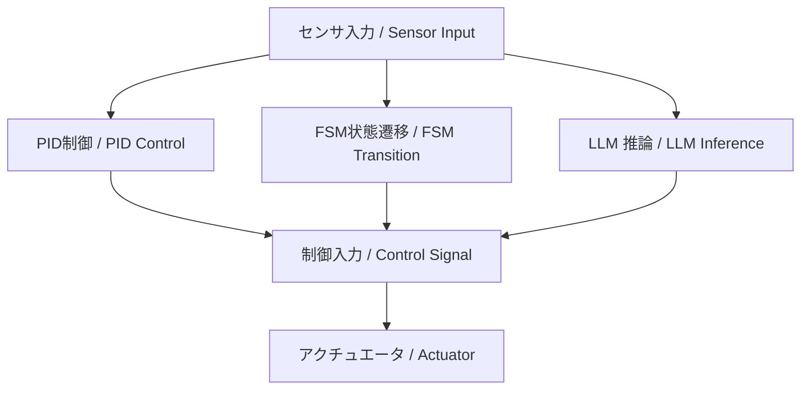

---

# 🤖 01. FSM・PID・LLMによるハイブリッド制御（AITL構想）  
*Hybrid Control with FSM, PID, and LLM (AITL Framework)*

---

## 🌐 AITL三層設計の基本方針  
*Basic Principles of the AITL Three-Layer Design*

AITL構想は、**PID・FSM・LLMの三層構造**で設計されます：  
*The AITL framework is designed as a **three-layer structure of PID, FSM, and LLM***  

1. **PID（内側の制御ループ / Inner Control Loop）**  
   - 物理システムの安定性と応答を担保  
     *Guarantees stability and dynamic response of the physical system*  
   - 常にリアルタイムで動作する基礎制御  
     *Operates continuously in real time as the foundation of control*  
   - 数理設計はナイキスト安定判別やルートラーカスで検証  
     *Mathematical design verified via Nyquist stability criterion or root locus*  

2. **FSM（外側の監督層 / Supervisory Layer）**  
   - モード管理（次にどの動作を行うかを選択）  
     *Mode management, i.e., selecting the next operation*  
   - 状態遷移関数 δ と出力関数 λ に基づきタスクを割り当て  
     *Tasks allocated based on transition function δ and output function λ*  
   - 形式定義：FSM = (S, I, O, δ, λ, s₀)  
     *Formal definition: FSM = (S, I, O, δ, λ, s₀)*  

3. **LLM（最外側の知性層 / Intelligence Layer）**  
   - 故障・異常・環境変化時に介入し、システム再設計を行う  
     *Intervenes in case of faults, anomalies, or environmental changes to perform system redesign*  
   - PIDゲイン調整やFSM遷移ルール修正、新規ゴール生成を担当  
     *Handles PID gain retuning, FSM rule modification, and new goal generation*  
   - 実時間制御ループには入らず、提案者として作用  
     *Does not participate in the real-time loop; acts only as an advisor*  

---

## 📊 全体構造（概念図）  
*Overall Architecture (Conceptual Diagram)*

```
[ LLM ]  ← 再設計・例外処理（故障対応、ゴール更新）
   │
   ▼
[ FSM ]  ← モード管理（次に何をする？）
   │
   ▼
[ PID ]  ← 安定化（物理制御ループ）
   │
   ▼
[ Plant / Robot ]
```

---

本節では、FSM（本能層）、PID（理性層）、LLM（知性層）という  
**三層構造のハイブリッド制御アーキテクチャ**である「AITL構想」について解説します。  
*This section explains the AITL concept: a three-layer hybrid control architecture consisting of FSM (instinct layer), PID (reasoning layer), and LLM (intelligence layer).*

---

## 🧠 **AITL構想とは？ / What is AITL Framework?**

AITL（Artificial Instinct–Thinking–Language）は、以下の3層構造を持つ制御モデルです：  
*AITL (Artificial Instinct–Thinking–Language) is a control model with the following three layers:*  

| **層 / Layer** | **要素 / Element** | **役割 / Role** |
|----|------|------|
| **本能層 / Instinct Layer** | FSM（状態機械 / Finite State Machine） | 基本動作やルール実行 <br>*Executes basic actions and rules* |
| **理性層 / Reasoning Layer** | PID制御 | 物理系の安定・精度を保証 <br>*Ensures stability and precision of physical systems* |
| **知性層 / Intelligence Layer** | LLM（大規模言語モデル / Large Language Model） | 状況判断・例外対応・目的推論・対話 <br>*Contextual reasoning, exception handling, goal reasoning, dialogue* |

---

## 🧩 **各層の制御構成 / Control Structure of Each Layer**

### ✅ FSM  
- タスクの流れや状態遷移条件を定義  
  *Defines task flows and state transition conditions*  
- 例：ロボットの「停止 → 前進 → 回避」フロー  
  *Example: Robot flow "Stop → Move Forward → Avoid"*  

### ✅ PID制御  
- フィードバック制御の中心  
  *Core of feedback control*  
- FSMの各状態での制御器として動作  
  *Acts as the controller in each FSM state*  
- 実時間で物理系とやり取り  
  *Interacts with the physical system in real time*  

📐 基本式 / Basic Formula:  
$$
u(t) = K_p e(t) + K_i \int_0^t e(\tau)\, d\tau + K_d \frac{de(t)}{dt}
$$  

### ✅ LLM  
- **クラウド型（ChatGPT 等）**：設計支援や対話に強い  
  *Cloud-based (e.g., ChatGPT): strong in design support and dialogue*  
- **組み込み型（LLaMA, Phi, Mistral 等）**：制御ループに組込み可能  
  *Embedded (e.g., LLaMA, Phi, Mistral): integrable into control loops*  

📐 Attention の式 / Formula of Attention:  
$$
\text{Attention}(Q,K,V) = \text{softmax}\!\left(\tfrac{QK^T}{\sqrt{d_k}}\right)V
$$  

PIDのゲイン調整と対比できる。  
*Comparable to PID gain adjustment.*  

---

## 🏗️ **構成図 / Architecture Diagram**



---

## 🔍 **例：自律移動ロボット / Example: Autonomous Mobile Robot**

| **状態 / State** | **FSM動作 / FSM Action** | **PID制御 / PID Control** | **LLM関与 / LLM Involvement** |
|------|---------|----------|----------|
| 前進 / Move Forward | MoveForward | 距離維持 / Distance keeping | 行先判断 / Destination decision |
| 停止 / Stop | Idle | 出力ゼロ / Zero output | 対話・指示待ち / Dialogue, awaiting commands |
| 回避 / Avoid | Avoid | 軌道調整 / Path adjustment | 回避方向の判断 / Deciding avoidance direction |

---

## 💡 **目的と利点 / Purpose and Advantages**

- **FSM**：ルールベースの安定性保持  
  *Rule-based stability maintenance*  
- **PID**：精密な物理制御  
  *Precise physical control*  
- **LLM**：環境変化・例外対応・新規タスク適応  
  *Adaptation to environmental changes, exceptions, and new tasks*  

---

## 📁 **次へ / Next**

📄 [02_scenario_control.md](02_scenario_control.md)  
*Proceed to 02_scenario_control.md*  

---

**⬅️ [Part 9 トップに戻る](../index.md)**  
*Back to Part 9 top*  
**🏠 [トップページ](../../../index.md)**  
*Back to Home*
