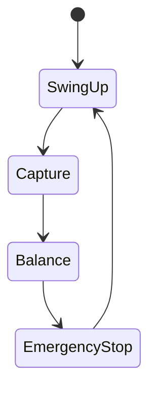

# 🧩 10-4 設計上の実例  
## 成立条件と破綻条件の整理  
*Design-Oriented Examples: When It Works and When It Breaks*

---

## 📌 本章の目的  
*Purpose of This Chapter*

本章では、倒立振子を題材として、  
**PID 制御および FSM による構造化が「どの条件で成立し、どこで破綻するのか」**  
を、**具体的な状況例**として整理します。

*This chapter organizes concrete scenarios to clarify under what conditions PID control and FSM-based structuring succeed or fail.*

数式展開や実装コードは扱いません。  
本章はあくまで、

> **設計判断に直結する「現象レベルの実例」**

に限定します。

*No equations or implementation code are discussed; the focus is on phenomena that directly influence design decisions.*

---

## 🔹 実例1：PID 制御が成立する典型例  
*Example 1: Typical Case Where PID Control Works*

### 状況  
*Conditions*

- 📐 振子角度が直立近傍にある  
  *Pendulum angle is close to upright*
- 🔍 初期角度偏差が小さい  
  *Small initial angular deviation*
- ⚡ アクチュエータに十分な余裕がある  
  *Actuator has sufficient margin*

### 観測される挙動  
*Observed Behavior*

- 小角近似が成立する  
  *Small-angle approximation holds*
- 状態は線形近似モデルで十分に表現できる  
  *Linearized model adequately represents the system*
- PID 制御により安定化が可能  
  *PID control achieves stabilization*

### 設計上の意味  
*Design Implication*

- PID が「強力」なのではない  
- **制御対象の条件が PID の前提と一致している**

*PID is not powerful by itself; the plant simply satisfies PID’s assumptions.*

---

## 🔹 実例2：PID 制御が破綻する典型例  
*Example 2: Typical Case Where PID Control Fails*

### 状況  
*Conditions*

- 📐 初期角度が大きい  
  *Large initial angle*
- 🚧 台車位置制限に近い  
  *Cart position close to its limit*
- 🔋 モータ電圧・電流の飽和が発生する  
  *Motor voltage/current saturation occurs*

### 観測される挙動  
*Observed Behavior*

- 線形近似が成立しない  
  *Linear approximation breaks down*
- 積分項が過大となり振動が増幅する  
  *Integral term grows excessively and amplifies oscillations*
- ゲイン調整では回避できない不安定化が生じる  
  *Instability cannot be avoided by tuning gains*

### 設計上の意味  
*Design Implication*

- 問題は「調整不足」ではない  
- **PID が成立する前提条件そのものが崩れている**

*The issue is not poor tuning; the fundamental assumptions no longer hold.*

---

## 🔹 実例3：FSM を重ねた場合の改善点  
*Example 3: Improvements Achieved by Adding FSM*

### 構造例（概念）  
*Conceptual Structure*

### 観測される変化  
*Observed Changes*

- PID を使用する状態が明確に限定される  
  *PID usage is explicitly limited to specific states*
- 飽和・異常時に別の振る舞いを選択できる  
  *Alternative actions are taken under saturation or abnormal conditions*
- 制御系全体の動作が状態遷移として可視化される  
  *Overall behavior becomes visible as state transitions*

### 設計上の意味  
*Design Implication*

- FSM は PID の性能を向上させない  
- **破綻しやすい条件を構造的に回避するための手段**

*FSM does not improve PID performance; it structurally avoids failure-prone situations.*

---

## 🔹 実例4：FSM を用いても解決しない点  
*Example 4: Limitations That Remain Even with FSM*

### 残る課題  
*Remaining Issues*

- 📉 モデル誤差が大きい場合の不安定化  
  *Instability under large model mismatch*
- 🧠 状態遷移条件の設計は人手に依存する  
  *Transition conditions rely on manual design*
- 📊 状態数増加に伴う設計複雑化  
  *Design complexity increases with more states*

### 設計上の意味  
*Design Implication*

- FSM は万能ではない  
- **整理はできるが、最適化や自律適応は別問題**

*FSM helps organize behavior but does not provide optimality or adaptability.*

---

## 🧭 本章の位置づけ  
*Position of This Chapter*

本章の実例は、  
**10-1〜10-3 で示したモデル・理論・構造**を  
**設計判断の視点から再確認するための補助資料**です。

*These examples serve as supporting material to revisit the models, theory, and structure discussed in 10-1 through 10-3 from a design-decision perspective.*

ここで強調したいのは次の点です。

*The key takeaway is:*

> PID 制御や FSM は  
> 「手法」ではなく  
> **条件付きの設計選択である**

> *PID and FSM are not universal methods,  
> but conditional design choices.*

---
