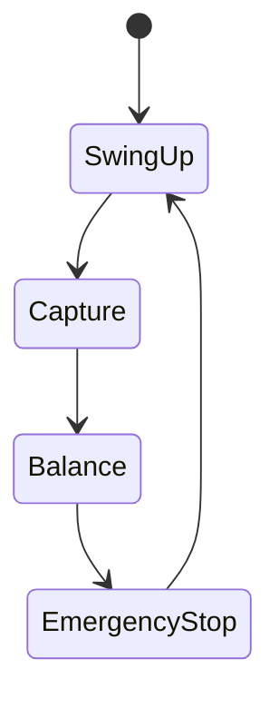

# 10-4：設計上の実例 / Practical Examples

本章では、倒立振子を題材として、  
**PID 制御および FSM を用いた構造化が「どの条件で成立し、どこで破綻するか」**  
を、具体的な状況例として整理する。

数式展開や実装コードは扱わず、  
**設計判断に直結する現象レベルの実例**に限定する。

---

## 実例1：PID 制御が成立する典型例

### 状況
- 振子角度が直立近傍にある  
- 初期角度偏差が小さい  
- アクチュエータに十分な余裕がある  

### 観測される挙動
- 小角近似が成立する  
- 状態は線形近似モデルで十分に表現できる  
- PID 制御により安定化が可能  

### 設計上の意味
- PID が「強い」のではない  
- **制御対象の条件が PID の前提と一致している**

---

## 実例2：PID 制御が破綻する典型例

### 状況
- 初期角度が大きい  
- 台車位置制限に近い  
- モータ電圧・電流の飽和が発生する  

### 観測される挙動
- 線形近似が成立しない  
- 積分項が過大となり振動が増幅する  
- ゲイン調整では回避できない不安定化が生じる  

### 設計上の意味
- 問題は「調整不足」ではない  
- **PID が成立する前提条件そのものが崩れている**

---

## 実例3：FSM を重ねた場合の改善点

### 構造例（概念）

### 観測される変化
- PID を使用する状態が明確に限定される  
- 飽和・異常時に別の振る舞いを選択できる  
- 制御系全体の動作が状態遷移として可視化される  

### 設計上の意味
- FSM は PID の性能を向上させない  
- **破綻しやすい条件を構造的に回避するための手段**

---

## 実例4：FSM を用いても解決しない点

### 残る課題
- モデル誤差が大きい場合の不安定化  
- 状態遷移条件の設計は人手に依存する  
- 状態数の増加に伴う設計複雑化  

### 設計上の意味
- FSM は万能ではない  
- **整理はできるが、最適化や自律適応は別問題**

---

## 本章の位置づけ

本章の実例は、  
10-1〜10-3 で示したモデル・理論・構造の内容を  
**設計判断の観点から確認するための補助資料**である。

これらの実例を通して、  
PID 制御および FSM による構造化を  
「手法」ではなく「条件付きの設計選択」として捉えることを意図している。
